# 2) Data Understanding

- **Data Source:** IBM’s public dataset – *Telco Customer Churn* (https://www.kaggle.com/datasets/blastchar/telco-customer-churn/data).
- **Data Structure:** Each row represents a customer; columns include gender, contract type, internet service, total charges, and more.
- **Target Variable:** `Churn` (binary: "Yes" or "No").

---

## 2.1 General Overview

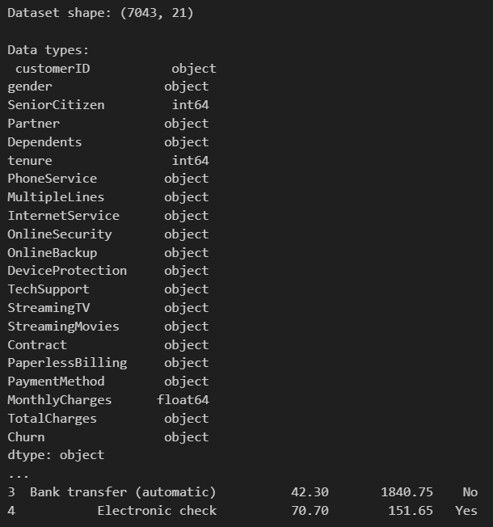

Key Insights from the Data Overview

1. Dataset Dimensions

* The dataset contains 7,043 rows (customers) and 21 columns (features).

Insight: This is a medium-sized dataset, suitable for supervised learning models without the need for heavy big data tools.

---

## 2.2 Check for missing values

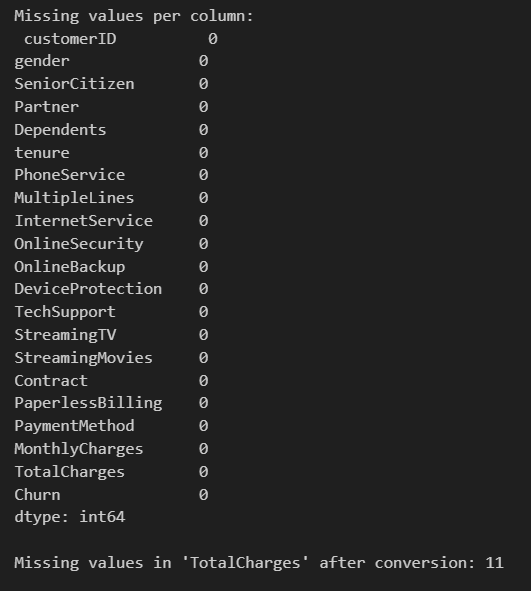

---

## 2.3 Descriptive statistics

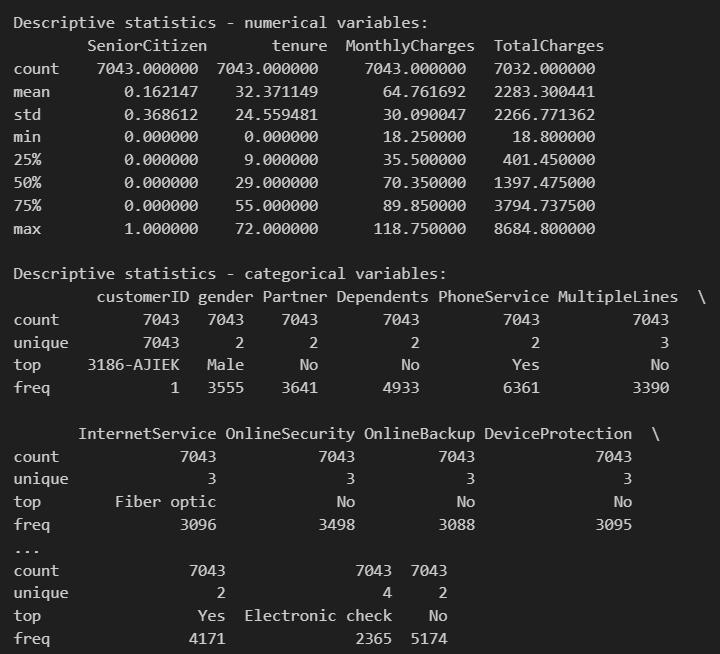

---

## 2.4 Target variable distribution

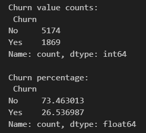

---

## 2.5 Churn distribution plot

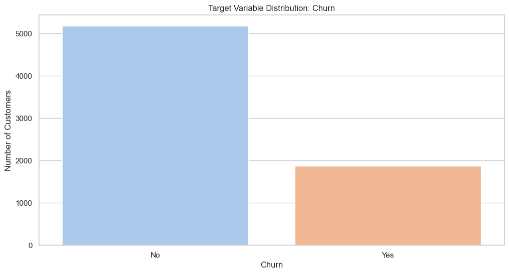

Key Insights from the Churn Distribution Plot

1. Class imbalance is present

The bar chart clearly shows a strong imbalance between the two classes:

* The number of customers who did not churn (No) is significantly higher than those who did churn (Yes).
* Visually, churned customers represent roughly 25–27% of the dataset.

Insight:
This is a class imbalance problem, and ignoring it during modeling could lead to biased models that predict mostly "No" and still achieve high accuracy.

---

## 2.6 Correlation heatmap (numerical)

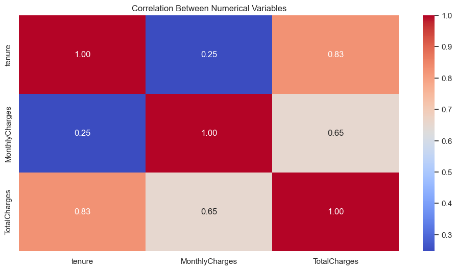

Key Insights from the Correlation Heatmap

1. High correlation between TotalCharges and tenure

Correlation = 0.83

This is a strong positive correlation.

Insight:

* The longer a customer stays (tenure), the higher their total charges (TotalCharges).
* This makes sense since TotalCharges ≈ MonthlyCharges × tenure for most cases.

However, TotalCharges also depends on optional services, so it's not a perfect linear relation (not 1.00).

2. Moderate correlation between TotalCharges and MonthlyCharges

Correlation = 0.65

Insight:

* Customers with higher monthly charges tend to accumulate higher total charges.
* But this is not always the case, especially for short-tenure customers or those who churn early.

3. Weak correlation between tenure and MonthlyCharges

Correlation = 0.25

Insight:

* There is little relationship between how long a customer has been with the company and their monthly plan cost.
* This is useful: some long-term customers may still be on cheaper plans, and vice versa

---

## 2.7 Churn by Contract Type

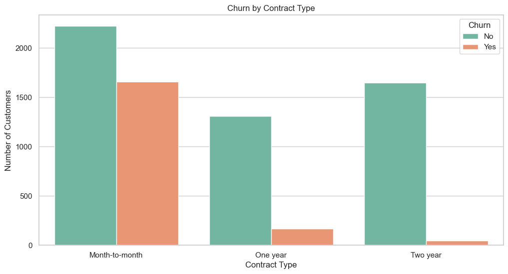

Key Insights from Churn by Contract Type

1. Churn is highest among Month-to-month contracts

Customers with Month-to-month contracts have a much higher churn rate than those with long-term contracts.

The orange (Churn = Yes) portion is almost equal to the green (No) portion in that group.

Insight:

* Customers who are not locked into a contract are far more likely to leave.
* This supports the business assumption that flexibility increases risk of churn.

2. Churn is lowest among Two-year contracts

Very few customers with a Two-year contract churned.

The green bar (retained customers) dominates.

Insight:

* Longer contract commitments are strongly associated with customer retention.

3. One-year contracts show moderate churn

Churn exists but is much lower than for Month-to-month, and higher than for Two-year.

Insight:

* This group may represent a transitional customer profile — not as loyal as long-term clients, but more stable than those with no commitment.

---

## 2.8 Distribution of numerical variables segmented by Churn

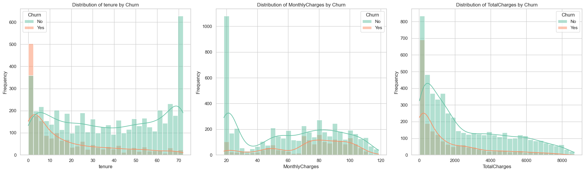

Insights from Numerical Variable Distributions by Churn

1. tenure vs Churn

Most churned customers (Churn = Yes) have low tenure (especially ≤ 10 months).

Long-tenure customers (e.g., ≥ 50 months) have very low churn.

Insight:

* Early churn is a critical risk. New customers are much more likely to leave within the first year.

2. MonthlyCharges vs Churn

Customers with higher monthly charges (≥ $70) churn more frequently.

Lower charges (~$20) are dominated by retained customers.

Insight:

* High-value plans may increase churn risk if perceived value isn’t delivered.

3. TotalCharges vs Churn

Churned customers have lower TotalCharges, peaking below $2,000.

Customers with high TotalCharges (≥ $5,000) show low churn.

Insight:

* Churn tends to happen before significant revenue is accumulated — often early in the lifecycle.

---

## 2.9 Boxplots para detectar outliers por Churn

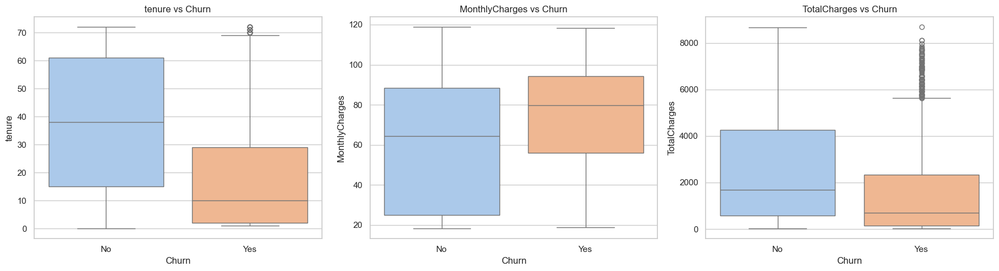

Key Insights from Boxplots: Numerical Features vs Churn

**A) tenure vs Churn**

Customers who churned (Yes) have a significantly lower median tenure than those who stayed.

The churn group has a tight IQR concentrated at low tenure values, with fewer long-tenure outliers.

Insight:

* Most churn happens early. Long-standing customers are less likely to leave.

**B) MonthlyCharges vs Churn**

The median MonthlyCharges is higher for churned customers.

The churn group has a tighter IQR skewed toward higher charges, indicating less price tolerance.

Insight:

* Customers paying more are more sensitive and more likely to churn, possibly due to unmet expectations.

**C) TotalCharges vs Churn**

Churned customers have much lower total charges overall, with many low outliers.

The retained customers (No) have a wider and higher IQR and more extreme high values.

Insight:

* Customers typically churn before becoming high-revenue clients.

---

## 2.10 Bar chart for categorical variables vs Churn

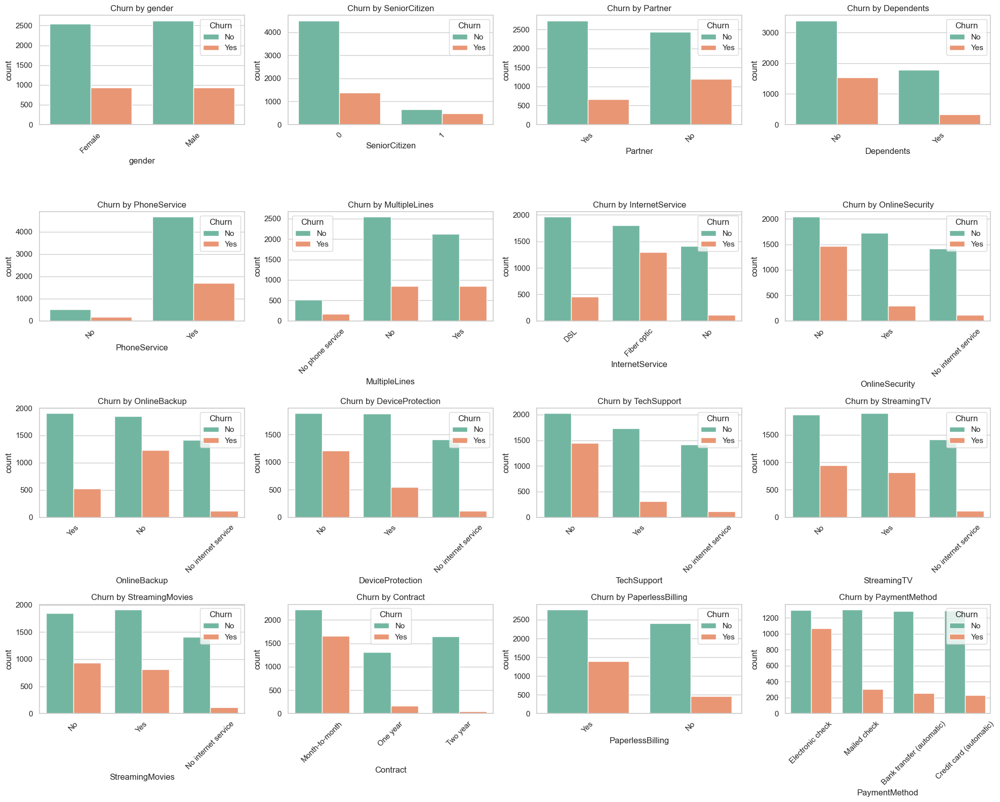

Insights on Bar chart for categorical variables vs Churn:

Contract Type is Crucial

* Month-to-month contracts have a much higher churn rate compared to One year and Two year contracts.
* Longer-term contracts help in customer retention.

Internet Service

* Customers using fiber optic internet show higher churn than those using DSL or having no internet service.

OnlineSecurity, OnlineBackup, DeviceProtection, TechSupport

* Customers without these add-on services are more likely to churn.
* Having these services appears to reduce churn risk, possibly due to increased engagement or satisfaction.

Streaming Services

* Customers with StreamingTV or StreamingMovies show slightly higher churn, but the impact is less pronounced than technical services like security or backup.

Senior Citizens

* Although they represent a smaller group, senior citizens tend to churn more frequently than younger users.

Dependents and Partners

* Customers without dependents or partners tend to churn more, suggesting that households with families may be more stable subscribers.

Phone Service and Multiple Lines

* No major difference in churn between those with or without PhoneService.
* Having multiple lines does not show a strong correlation with churn.

Paperless Billing

* Customers using paperless billing have a higher churn rate, possibly linked to more tech-savvy, deal-hunting behavior.

Payment Method

* Electronic check users have a notably higher churn rate than those using automatic payments (like credit cards or bank transfers).
* Suggests that automatic payment methods help retain customers.

Gender

* No significant difference in churn between males and females – gender is not a key driver of churn.

---

## 2.11 Cross-tabulation + churn percentage by category

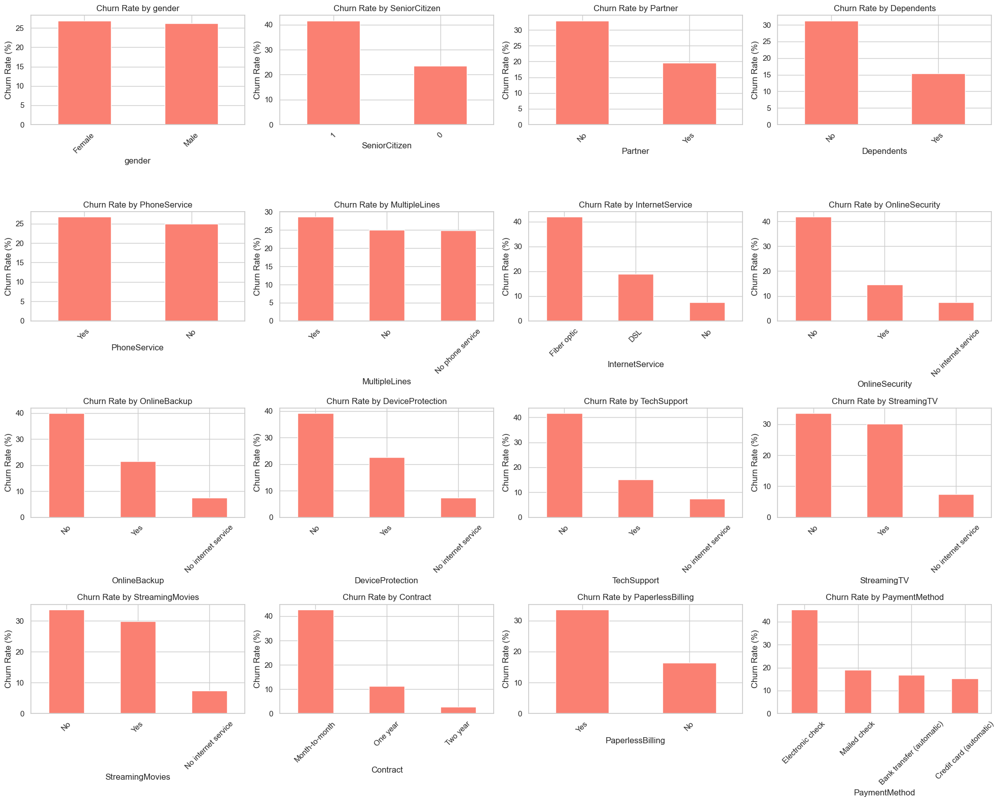

Insights on Cross-tabulation + churn percentage by category

Contract Type:

* Month-to-month contracts have by far the highest churn rate, over 40%.
* One year and especially Two year contracts show much lower churn, confirming the loyalty associated with longer commitments.

Internet Service:

* Customers using Fiber optic internet have the highest churn rate among all internet service types.
* Customers with no internet service are much less likely to churn.

Online Services (OnlineSecurity, OnlineBackup, DeviceProtection, TechSupport):

* Customers who lack these services have substantially higher churn rates.
* Those who use these features are more loyal, suggesting these services contribute to customer retention.

Paperless Billing:

* Customers with Paperless Billing enabled show a higher churn rate than those who don’t use it. This could be linked to tech-savviness or reduced personal connection.

Senior Citizens:

* Senior citizens show a higher churn rate than younger customers.

Dependents & Partner:

* Customers with no dependents or no partner churn more frequently, which may indicate a single-person household is more price-sensitive or less loyal.

Payment Method:

* Electronic check users churn much more than those who use other payment methods (like credit card or bank transfer). Possibly due to financial instability or payment flexibility.

StreamingTV and StreamingMovies:

* Interestingly, whether or not the customer subscribes to streaming services does not greatly affect churn. The churn rate remains relatively balanced between “Yes” and “No”.

Multiple Lines:

* Having multiple phone lines slightly correlates with higher churn, though the difference is not drastic.

Gender:

* No significant difference in churn rate between Male and Female customers — gender is not a predictive churn feature.

---

## 2.12 Churn analysis by customer tenure

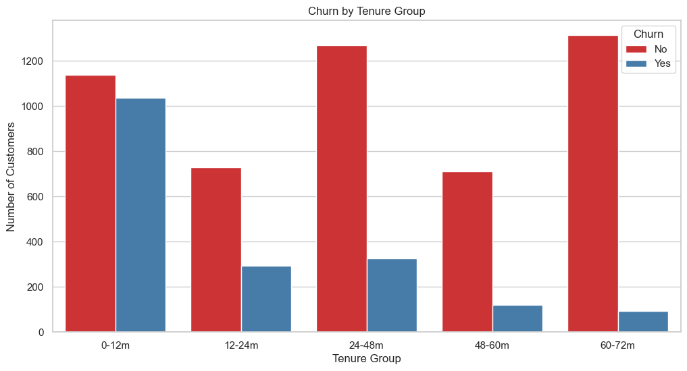

Key Insights from Churn by Tenure Group

**A) Churn is highest in the first 12 months (0–12m)**

The 0–12m group has the highest absolute number of churns.

Nearly equal bars for Churn = Yes and No, indicating high churn rate.

Insight:

* New customers are at the highest risk of churn — the first year is critical.

**B) Churn decreases with customer longevity**

Churn counts drop significantly for customers in the 48–60m and 60–72m ranges.

These long-tenure groups are dominated by non-churners.

Insight:

* Customers who remain longer tend to be satisfied and loyal.

**C) Unusual churn spike in 24–48m group**

A noticeable rise in churn count appears in 24–48m, despite customers being mid-tenure.

Churn > retention in this group.

Insight:

* Mid-term customers may hit a satisfaction plateau or contract renewal point that triggers churn.

---

## 2.13 Pairplot (multivariate exploration)

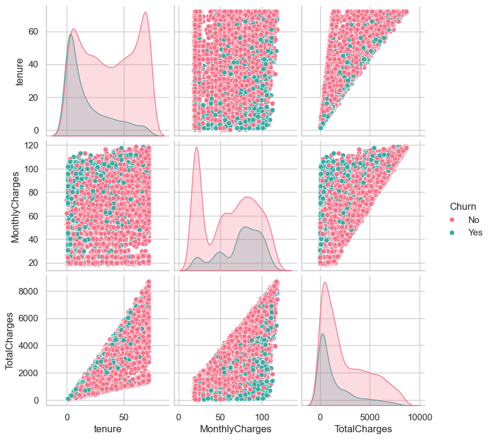

Key Insights from Pairplot Analysis

**A) Churn is highly concentrated among low-tenure customers**

In the tenure vs other features plots, churned customers (Churn = Yes, in teal) cluster heavily at low tenure values (closer to 0).

Customers who stayed (Churn = No, in pink) are more widely spread across the entire tenure range.

Insight:

* Most churn occurs early in the customer lifecycle, confirming previous insights from histograms and boxplots.

**B) Clear diagonal trend between tenure and TotalCharges**

There’s a strong linear relationship between tenure and TotalCharges for both churn and non-churn groups.

However, customers who churned are clustered toward the lower-left corner (short tenure, low total charges).

Insight:

* Customers who churn don’t accumulate high value over time — they leave early before generating significant revenue.

**C) Churn appears across all ranges of MonthlyCharges**

Churned customers exist across all levels of monthly charges, though they’re more dense in the mid-to-high range (≈ $70–$100).

Retained customers dominate the low-cost segments.

Insight:

* While MonthlyCharges alone isn’t a strong separator, high-value plans still carry slightly more churn risk.

**D) Distribution on diagonals (KDE plots)**

The diagonal KDE plots show churned users with:

A sharp peak at low tenure

A broader and slightly higher range of MonthlyCharges

A right-skewed TotalCharges distribution mostly below 2,000

Insight:

* All three numerical variables have non-normal distributions, with churners clustering at the lower end of tenure and total value.

---

# Key Insights from Churn Analysis (CRISP-DM: Data Understanding Phase)

### 2.1. Customer Tenure & Churn Behavior
* Short-tenure customers (0–12 months) have the highest churn rate.
* Long-tenure customers (48+ months) rarely churn, indicating customer loyalty increases over time.
* The boxplot confirms that churned customers typically have much shorter tenures.

### 2.2. Monthly and Total Charges
* MonthlyCharges are slightly higher for churned customers.
* TotalCharges are significantly lower among churned customers, which correlates with short tenure.
* Histograms and KDE plots reveal a clear density difference between churned and retained customers, especially in TotalCharges.

### 2.3. Tenure Groups
* When grouping customers by tenure ranges (e.g., 0–12m, 12–24m, etc.):
* The 0–12m group has the largest number of churners.
* The 60–72m group has nearly no churners, showing strong customer retention among long-term users.

### 2.4. Pairplot Correlation
* The strongest linear relationship is between Tenure and TotalCharges.
* Churned customers are clustered toward the lower-left corner, reflecting low tenure and low total charges.
* This supports the hypothesis that early-stage customers are at highest churn risk.

### 2.5. Categorical Variables (Countplots & Churn Rates)

Contract Type:

* Month-to-month contracts show the highest churn (~45%).
* Two-year contracts show very low churn (<10%).

Internet Service:

* Fiber optic users churn more frequently.
* Customers with no internet service rarely churn.

Online Services:

* Lack of OnlineSecurity, Backup, DeviceProtection, or TechSupport is strongly associated with churn.

Billing Preferences:

* Paperless Billing users churn more often.
* Electronic check is the payment method with the highest churn rate.

Demographics:

* Senior citizens, single customers (no partner), and those without dependents are more likely to churn.
* Gender has no significant effect on churn.

---

[⬅ Voltar para a Página Inicial](index.md)
