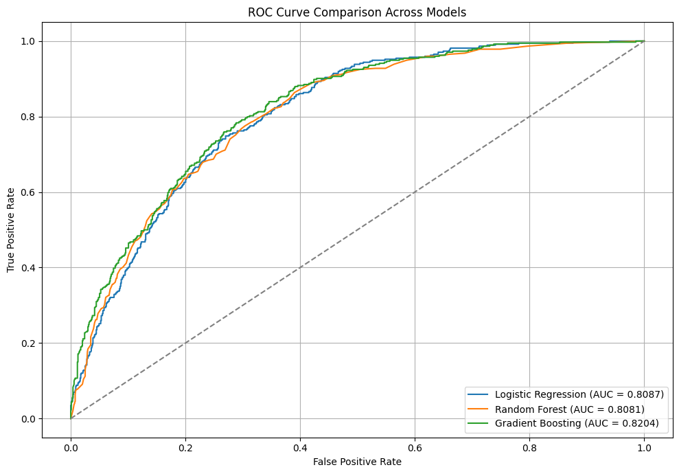
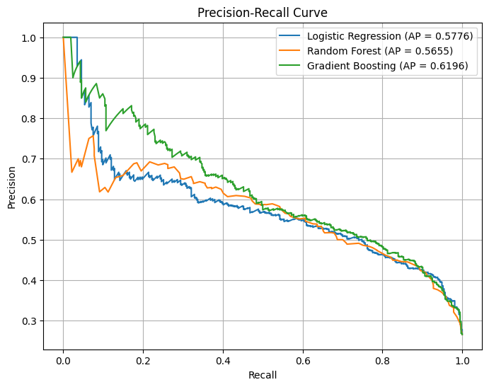
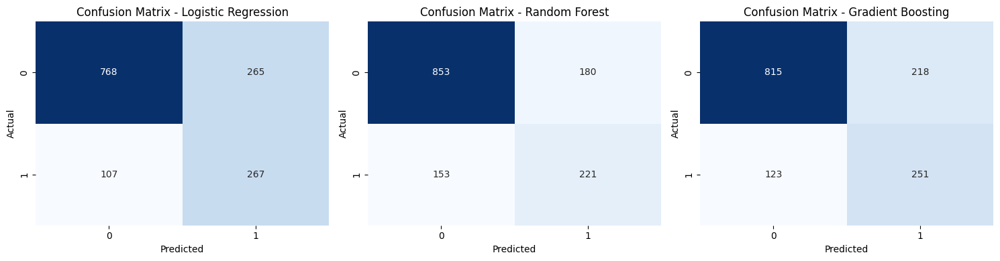
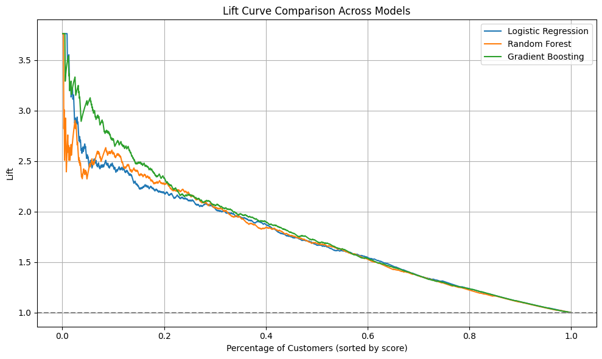
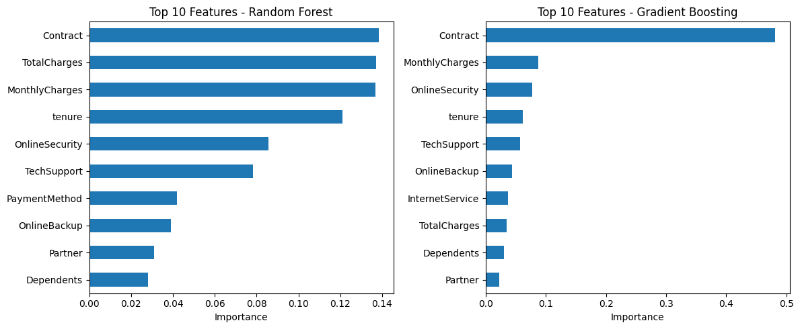
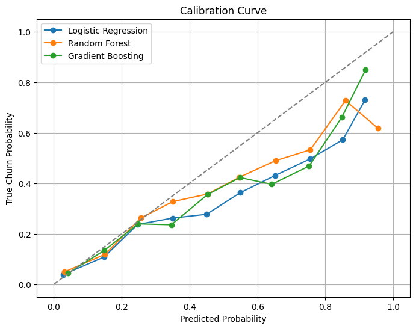

# 5) Evaluation (CRISP-DM methodology)

# Methodology Overview

In the **Evaluation phase** of CRISP-DM, we assessed and compared the performance of three machine learning models:
- Logistic Regression
- Random Forest
- Gradient Boosting

This step involved a detailed analysis of various metrics and visual tools to determine the model best suited to predict customer churn. The methodology applied includes:

---

### ✅ 5.1. **Model Performance Metrics**
- **Accuracy**: Overall correctness of predictions.
- **Precision**: Correct positive predictions over all predicted positives.
- **Recall**: Correct positive predictions over all actual positives.
- **F1-Score**: Harmonic mean of precision and recall.
- **ROC AUC**: Measures model’s ability to distinguish between classes.

---

### 📈 5.2. **ROC Curve**
- Visualizes the trade-off between the True Positive Rate and False Positive Rate at various thresholds.

---

### 🔁 5.3. **Precision-Recall Curve**
- Useful for imbalanced datasets.
- Shows the trade-off between precision and recall.

---

### 🧮 5.4. **Confusion Matrix**
- Matrix that shows true positives, true negatives, false positives, and false negatives for each model.

---

### 📊 5.5. **Lift Curve**
- Evaluates the effectiveness of the model in identifying high-risk customers compared to random selection.

---

### 💡 5.6. **Feature Importance**
- Identifies which features contribute the most to the model’s predictions (for tree-based models).

---

### 📏 5.7. **Calibration Curve**
- Assesses how well the predicted probabilities align with the actual outcomes.

---

These evaluation methods ensure a comprehensive and reliable comparison of the models’ performance before deployment.

---

## 5.1) ROC Curve Analysis for Churn Prediction Models

The ROC (Receiver Operating Characteristic) Curve illustrates the trade-off between the True Positive Rate (Recall) and the False Positive Rate for different classification thresholds. The Area Under the Curve (AUC) provides a single metric that summarizes model performance across all thresholds.

### Key Insights:

- **Gradient Boosting** achieved the highest AUC (**0.8204**), indicating the best ability to discriminate between churners and non-churners among the evaluated models.
- **Logistic Regression** and **Random Forest** yielded nearly identical AUCs (**0.8087** and **0.8081**, respectively), performing only slightly below Gradient Boosting.
- All models significantly outperform the random guess baseline (diagonal line), showing that they are effective at classifying churn vs. no churn.
- The ROC curves are relatively close to each other, suggesting that although Gradient Boosting has a small edge, the performance difference among models is not dramatic.

---

## 5.2) Model Performance Comparison – Churn Prediction

This table summarizes the key performance metrics for three machine learning models: **Logistic Regression**, **Random Forest**, and **Gradient Boosting**. The evaluated metrics include ROC AUC, Accuracy, Precision, Recall, and F1-Score.

### Key Insights:

| Metric              | Logistic Regression | Random Forest | Gradient Boosting |
|---------------------|---------------------|---------------|-------------------|
| **ROC AUC**         | 0.8087              | 0.8081        | **0.8204**        |
| **Accuracy**        | 0.7356              | **0.7633**    | 0.7576            |
| **Precision (Churn)** | 0.5019            | **0.5511**    | 0.5352            |
| **Recall (Churn)**  | **0.7139**          | 0.5909        | 0.6711            |
| **F1-Score (Churn)**| 0.5894              | 0.5703        | **0.5955**        |

### Interpretation:

- **Gradient Boosting** demonstrates the best overall balance, with the highest **ROC AUC (0.8204)** and **F1-Score (0.5955)**, making it a strong candidate for churn prediction where both precision and recall matter.
- **Random Forest** yields the best **accuracy (0.7633)** and **precision (0.5511)**, suggesting it is more conservative in predicting churn and may produce fewer false positives.
- **Logistic Regression** achieves the **highest recall (0.7139)**, meaning it is more sensitive to detecting actual churners, but at the cost of lower precision.

---

### 5.3) **Precision-Recall Curve Insights**

#### Gradient Boosting Performs Best on Precision-Recall Trade-off
- **Gradient Boosting** (green curve) achieved the **highest average precision (AP = 0.6196)**.
- This suggests it is the most effective model in distinguishing churners from non-churners.
- Particularly useful in **imbalanced datasets**, where precision-recall is more meaningful than accuracy or ROC AUC.

#### Logistic Regression and Random Forest Perform Similarly
- **Logistic Regression (AP = 0.5776)** and **Random Forest (AP = 0.5655)** have similar curves.
- Despite Random Forest showing a slightly better ROC AUC previously, Logistic Regression performs slightly better in terms of **precision-recall**, indicating it generates fewer false positives at critical thresholds.

#### Usefulness in Imbalanced Classification
- Since churn prediction is an **imbalanced classification task**, the **Precision-Recall Curve is a more reliable evaluation metric** than overall accuracy or ROC AUC.
- The **higher the area under the precision-recall curve (AP)**, the more effective the model is at identifying churners.

---

## 5.4) Confusion Matrix Insights

Below is the summary of confusion matrices for the three models:

| Model                | True Negatives (TN) | False Positives (FP) | False Negatives (FN) | True Positives (TP) |
|---------------------|---------------------|-----------------------|-----------------------|----------------------|
| **Logistic Regression** | 768                 | 265                   | 107                   | 267                  |
| **Random Forest**       | 853                 | 180                   | 153                   | 221                  |
| **Gradient Boosting**   | 815                 | 218                   | 123                   | 251                  |

---

### Key Insights:

**Logistic Regression**

  - Strong performance in identifying churned customers (`TP = 267`) with the **lowest FN (107)**.
  - **Highest FP (265)** → more false alarms, predicting churn for non-churners.

**Random Forest**

  - Best at identifying non-churned customers (`TN = 853`) with the **lowest FP (180)**.
  - **Misses more churned customers** (`FN = 153`) → lower recall.

**Gradient Boosting**

  - Offers a **balanced prediction** with decent TP (251) and moderate FP/FN values.
  - Reflects its stable performance across **F1-score**, **AUC**, and **Precision-Recall** curves.

---

## 5.5) Lift Curve Insights

The **Lift Curve** shows how much better a model is at identifying churners compared to random selection.

### Key Insights:

**Gradient Boosting**:

  - Shows the **highest Lift in the top customer segments** (top 5% to 15%).
  - This indicates it is the **most effective at identifying customers with high churn probability** early on — ideal for **targeted marketing actions**.
  - Its Lift reaches close to **3.7**, meaning it's almost **3.7 times more effective than random selection** in the top sample segment.

**Random Forest**:

  - Competitive performance, with an initial Lift around **3.0**.
  - Decreases more gradually, maintaining **solid performance up to 30–40% of customers**.

**Logistic Regression**:

  - Shows the lowest Lift among the three, with **less separation between churners and non-churners**.
  - Despite being simpler, it still provides predictive value (initial Lift ~2.5), but the advantage quickly fades.

---

## 5.6) Feature Importance Analysis (Random Forest & Gradient Boosting)

The bar charts show the **Top 10 most important features** used by each model to predict customer churn. This helps us understand **which features most influence** the models' decision-making process.

### Random Forest Insights:
- **Contract** is the top feature, followed closely by **TotalCharges** and **MonthlyCharges**.
- Features related to the customer’s financial interaction and service plan dominate importance.
- **Tenure** (duration of relationship) is also critical, reflecting its strong association with loyalty.
- Additional important features include **OnlineSecurity**, **TechSupport**, and **PaymentMethod** — all tied to perceived service value.

### Gradient Boosting Insights:
- **Contract** is by far the most important feature, with much higher weight than all others.
- This suggests that the **type of contract** (e.g., month-to-month vs. one/two-year) has **significant predictive power** in identifying churn risk.
- Other features such as **MonthlyCharges**, **OnlineSecurity**, and **Tenure** still contribute but with **much lower relative importance**.
- Overall, GBM appears more focused, attributing stronger influence to fewer features.

---

## 5.7) Calibration Curve Analysis

The calibration curve evaluates how well a model’s **predicted probabilities** align with actual outcomes — in this case, **churn probabilities**.

### Interpretation:

- The **dashed diagonal line** represents perfect calibration — where predicted probability matches the observed probability.
- Curves **closer to the diagonal** indicate better-calibrated models.
- **Points above the diagonal** mean the model underestimates the probability (actual churn is higher).
- **Points below the diagonal** mean the model overestimates the probability.

### Key Insights:

- **Logistic Regression** shows reasonably good calibration across most of the probability bins, aligning fairly well with the ideal diagonal. It tends to slightly **underestimate churn** at higher probabilities.
- **Gradient Boosting** demonstrates a strong calibration up to ~0.7, and then significantly **overestimates** the probability near the end. However, it's better than Random Forest in the 0.9+ range.
- **Random Forest** generally **overestimates** churn probabilities, especially in higher ranges, which may lead to a higher false positive rate in high-risk groups.

---

# 5.8) Summary of Evaluation Results – Churn Prediction Project

During the evaluation phase of the CRISP-DM methodology, multiple machine learning models (Logistic Regression, Random Forest, and Gradient Boosting) were compared using a variety of metrics and visualizations. Below are the key summarized results:

---

# Key Summarized Insights:

**ROC Curve (AUC):**

* All models outperformed the random baseline, with **Gradient Boosting** achieving the highest AUC (0.8204), indicating the best capability to distinguish between churners and non-churners.

**Precision-Recall Curve (AP):**

* **Gradient Boosting** also achieved the highest average precision (AP = 0.6196), which is crucial in imbalanced datasets.

**Confusion Matrix:**

  - **Logistic Regression** identified the highest number of churners correctly (TP = 267).
  - **Random Forest** had the lowest number of false positives (FP = 180).
  - **Gradient Boosting** showed balanced performance between true positives and false positives.

**Lift Curve:**

* **Gradient Boosting** demonstrated the highest lift (~3.7) in the top customer segments, making it the most effective for targeted marketing actions.

**Feature Importance:**

* The **Contract** variable was consistently the most influential across tree-based models, followed by **MonthlyCharges**, **TotalCharges**, and **Tenure**.

**Calibration Curve:**

* **Logistic Regression** showed overall good calibration. **Gradient Boosting** slightly overestimated churn at high probabilities but was better calibrated than Random Forest.

**Cross-Validation:**

* **Random Forest** achieved the highest average ROC AUC with the lowest variance (0.9266 ± 0.0488), indicating more stable performance.

[⬅ Voltar para a Página Inicial](index.md)
