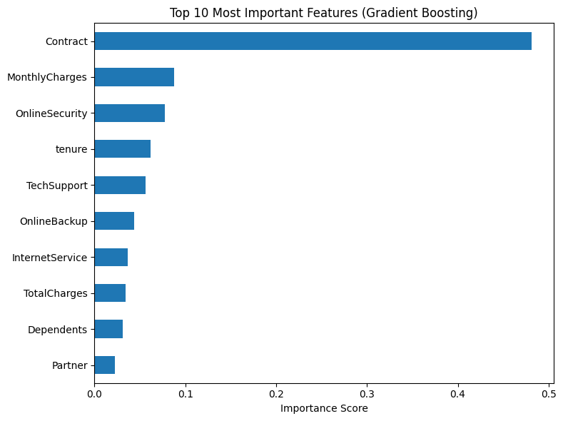
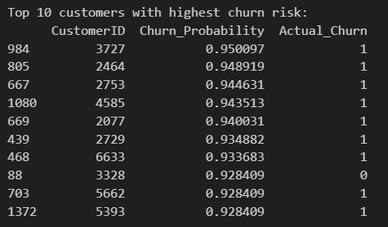
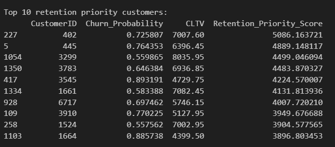
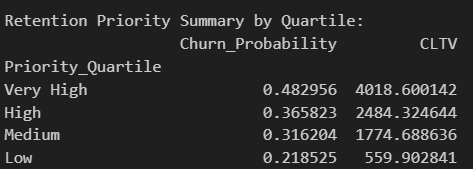

# 6) Project objectives addressed
#

### 🎯 6.1) Objetive 1. Detect key drivers of churn
> _"Detect key drivers of churn"_

✔️ **Implemented Using Feature Importance**
- The project used the `GradientBoostingClassifier`, a tree-based ensemble method that provides a reliable feature importance metric.
- A bar chart of the **Top 10 most important features** was generated.
- This helps identify attributes like `Contract`, `TechSupport`, and `TotalCharges` that most influence churn.
- Enables marketing and CRM teams to understand **why customers are leaving**.

---

### 🔍 Business Insight (Detect key drivers of churn)

#### Top Predictors Identified (Gradient Boosting Feature Importance)

1. **Contract** – By far the most influential factor.
   ▸ Customers with flexible (month-to-month) contracts are much more likely to churn than those on long-term agreements.

2. **MonthlyCharges** – Highly predictive of churn.
   ▸ Customers paying higher monthly fees are more prone to leave, possibly due to cost sensitivity or unmet expectations.

3. **OnlineSecurity** – Strong negative correlation with churn.
   ▸ Customers without online security are more likely to churn, suggesting this service may increase customer stickiness.

4. **Tenure** – Loyalty indicator.
   ▸ Customers with shorter tenure are more likely to churn. Long-standing customers are less at risk.

5. **TechSupport**, **OnlineBackup** – Meaningful contributors.
   ▸ Add-on services such as tech support and backup correlate with lower churn rates, likely due to enhanced service engagement.

6. **InternetService**, **TotalCharges** – Relevant, but less dominant.
   ▸ Fiber optic users may churn more, and lower total charges often reflect newer, high-risk customers.

7. **Dependents**, **Partner** – Moderate influence.
   ▸ Customers with no dependents or partner tend to churn more, possibly due to lower stability or loyalty.

---

### 📈 Business Insights

- **Contractual flexibility** is the most powerful driver of churn. Month-to-month users should be prioritized for retention incentives or upgrades to longer-term plans.
- **Value-added services** like OnlineSecurity and TechSupport show a protective effect. Bundling them in promotional packages could reduce churn.
- **High-bill customers** are more volatile. Consider delivering personalized experiences or loyalty rewards to increase perceived value.
- **Demographic features** (partner/dependent status) can help create **behavioral customer personas** for targeted retention campaigns.

---

### 🎯 6.2) Objetive 2. Estimate individual churn probabilities (scoring)
> _"Estimate individual churn probabilities (scoring)"_

✔️ **Implemented Using Model Predictions**
- The model outputs **individual churn probabilities** with `predict_proba()`.
- Probabilities are stored in a DataFrame and sorted.
- This allows teams to **identify high-risk customers** and act proactively.
- The top 10 churn-prone customers are highlighted.

---

## 🔍 Key Insights – Churn Scoring (Objective 2: Estimate churn probability - scoring)

1. **High accuracy in identifying churn-prone customers**
   Among the top 10 customers with the highest predicted churn probability, **9 actually churned** (`Actual_Churn = 1`). This shows the model is **highly effective** at capturing relevant patterns.

2. **Very high probabilities (above 0.92)**
   Most listed customers have **probabilities above 0.93**, indicating that the model produces **highly reliable risk scores** for prioritization.

3. **Direct applications for personalized retention**
   Identifying high-risk customers enables proactive actions by **Marketing and CRM teams**, such as:
   - Offering personalized discounts;
   - Launching re-engagement campaigns;
   - Prioritizing high-risk customers for support.

4. **Segmentation and automation of actions**
   The churn scores can be combined with CLTV or demographic profiles to **segment campaigns**, increase ROI, and **reduce churn strategically**.

5. **Potential for integration into dashboards and CRM systems**
   The scores can be exported or visualized in dashboards for **real-time churn risk monitoring and decision-making**.

---

### 🎯 6.3) Objetive 3. Prioritize retention actions based on churn risk and CLTV
> _"Prioritize retention actions based on churn risk and Customer Lifetime Value (CLTV)"_

✔️ **Implemented Using Priority Score**
- A new score was calculated:
  `Retention_Priority_Score = Churn_Probability × TotalCharges`
- `TotalCharges` acts as a proxy for **CLTV**.
- Customers are segmented by **quartiles of priority**.
- Enables **focused retention strategies** on high-value, high-risk customers.

---

### 🔍 Key Insights (Objective 3: Retention Prioritization Based on CLTV - Customer Lifetime Value- (TotalCharges)):

- The **Retention Priority Score** effectively ranks customers based on both the **likelihood of churn** and their **financial value** to the company.
- The **top 10 customers** with the highest retention priority were identified, combining high churn risk with high CLTV.
- These high-value at-risk customers represent **critical targets** for personalized retention strategies.
- This approach allows marketing and CRM teams to:
  - **Allocate resources efficiently** to customers who matter most.
  - **Design proactive campaigns** aimed at preserving long-term revenue.
  - Segment the base by **quartiles of retention score** for scalable action plans.

  ---

## Quartile Segmentation Insights

Customers were divided into quartiles based on their Retention Priority Score:

| Priority Quartile | Avg. Churn Probability | Avg. CLTV |
|-------------------|------------------------|-----------|
| **Very High**     | 0.482956               | 4018.60   |
| **High**          | 0.365823               | 2484.32   |
| **Medium**        | 0.316204               | 1774.69   |
| **Low**           | 0.218525               | 559.90    |

---

### 🔍 Key Insights

- **Very High Priority Segment** has the highest churn probability (**48.3%**) and the highest average CLTV (~$4,000), indicating these are **high-value customers at high risk of churn**.
- **High and Medium segments** show moderate churn probability with substantial revenue potential, suitable for **cost-effective retention actions**.
- **Low Priority Segment** includes customers with **lower churn risk and low revenue contribution**, suggesting **less urgent action is needed**.

---

[⬅ Voltar para a Página Inicial](index.md)
