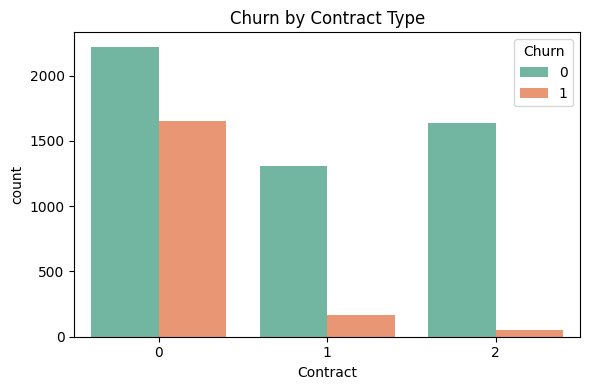
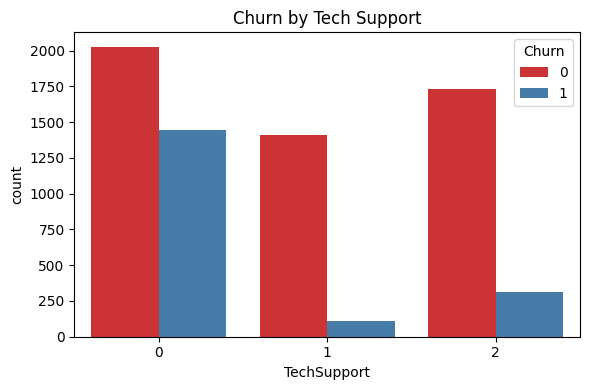
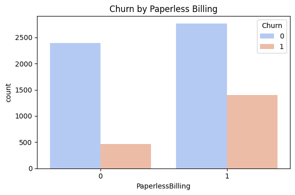
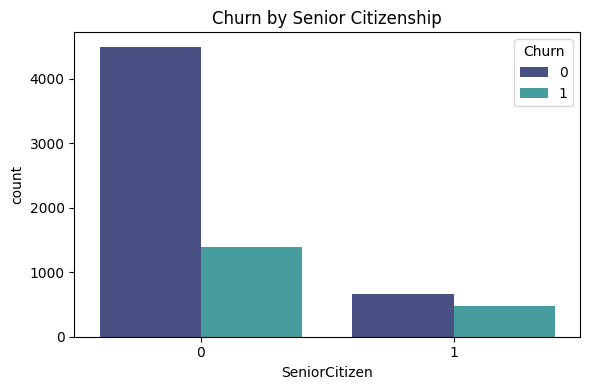
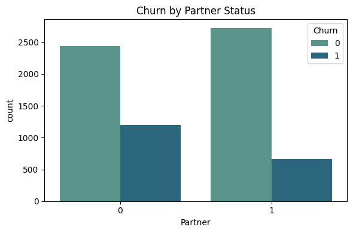
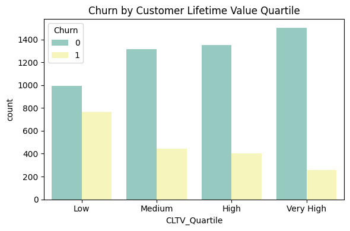

# Project Goals
#

**Primary Goal**:

Develop a binary classification model to predict whether a customer will cancel their service in the next billing cycle.

**Secondary Goal**:

Generate business insights through descriptive and inferential analytics, including dashboards that highlight:

  - Impact of features such as contract type, tech support, billing profile, etc.;
  - Demographic and geographic patterns among high-churn customers;
  - Actionable recommendations for targeted customer segments.

---

## 🎯 Primary Goal Analysis – Churn Prediction Model

The primary goal of this project was to develop a binary classification model capable of predicting whether a customer will cancel their service in the next billing cycle. The model selected for this task was the **Gradient Boosting Classifier**, trained using resampled and standardized data.

### Model Performance Summary

| Metric       | Churn = No (0) | Churn = Yes (1) |
|--------------|----------------|-----------------|
| Precision    | 0.87           | 0.54            |
| Recall       | 0.79           | 0.67            |
| F1-Score     | 0.83           | 0.60            |

**Overall Accuracy**: 0.76
**ROC AUC Score**: 0.8204

### Key Insights

- The model achieved a **ROC AUC of 0.8204**, indicating good overall discrimination between churners and non-churners.
- **Recall for churners** (0.67) shows the model can correctly identify 67% of customers who actually churned — a critical metric for proactive retention strategies.
- The **precision for churn** (0.54) indicates that just over half of predicted churners are true churners, reflecting some trade-off between catching more churners and accepting false positives.
- The **F1-score of 0.60** for churn indicates a balanced compromise between precision and recall in this imbalanced classification scenario.

---

## 6.4) **Secondary Goal**:

Generate business insights through descriptive and inferential analytics, including dashboards that highlight:

  - Impact of features such as contract type, tech support, billing profile, etc.;
  - Demographic and geographic patterns among high-churn customers;
  - Actionable recommendations for targeted customer segments.

---

## 6.4.1) Churn by Contract Type

The bar plot clearly shows the distribution of customer churn (`Churn = 1`) across different types of contracts (0 = Month-to-month, 1 = One year, 2 = Two year).

#### 🔍 Key Insights:

- **Month-to-month contracts (0)** have the highest churn rate. The churn count is nearly as high as the retention count.
- **One-year contracts (1)** show a significantly lower churn count compared to month-to-month customers.
- **Two-year contracts (2)** exhibit the lowest churn rate among all types.

### 📌 Graph Interpretation

- Customers with **short-term contracts** are more likely to churn, which aligns with the hypothesis that **flexibility leads to higher risk of attrition**.
- **Longer commitment contracts (one or two years)** serve as a natural retention mechanism.

### 💡 **Actionable Recommendations**:

- Offer **incentives or discounts** to month-to-month customers to encourage migration to annual plans.
- Use **contract length** as a key predictor in churn models to detect high-risk segments.
- Launch **loyalty programs** for short-term users to boost retention and customer commitment.

---

## 6.4.2) Churn by Contract Type

### 🔍 Insight: Technical Support Has a Strong Impact on Churn

- **Customers with no Tech Support (0)** have the **highest churn rate**, com uma grande proporção de clientes que saíram (Churn = 1).
- **Customers who opted for Tech Support (1 or 2)** têm **baixas taxas de churn**, indicando maior retenção.
- A diferença visual entre os grupos mostra que **ter suporte técnico é um forte fator de retenção**.

### 📌 Graph Interpretation

- Providing Tech Support services is strongly correlated with customer retention.
- Customers with no technical assistance are more prone to churn, possibly due to unresolved technical issues or low engagement.

### 💡 **Actionable Recommendations**:

   - Proactively offer Tech Support to customers at risk.
   - Include free or discounted Tech Support trials during the early tenure period.
   - Target upselling of Tech Support to customers in churn-prone segments.

---

### 6.4.3) Paperless Billing

### 📌 Graph Interpretation

- Customers who **use paperless billing (`PaperlessBilling = 1`)** show a **significantly higher number of cancellations** (`Churn = 1`) compared to those who don’t.
- Customers with traditional billing (`PaperlessBilling = 0`) have a **lower churn rate**.

#### 🔍 Key Insights:

- **Paperless Billing users** tend to **churn more frequently**.
- Possible explanation: These customers might be more **tech-savvy**, **price-sensitive**, or more **exposed to competitor promotions**.
- Their behavior may also suggest **lower brand engagement**, as the communication model is entirely digital.

### 💡 **Actionable Recommendations**:

1. **Launch retention campaigns for paperless billing users** with a high probability of churn.
2. **Monitor digital engagement** — are these users opening emails, checking their online account, etc.
3. **Offer exclusive perks or loyalty programs** to keep this group engaged and connected to the brand.

---

## 6.4.4) Churn by Senior Citizenship

### 📌 Graph Interpretation

The bar chart shows the distribution of churn among senior citizens (`SeniorCitizen = 1`) and non-senior customers (`SeniorCitizen = 0`), with the churn status represented by hue.

- **Non-Senior Customers (0):**
  - Represent the majority of the customer base.
  - Show a significant number of churns (Churn = 1), although more customers stay.

- **Senior Citizens (1):**
  - Comprise a smaller segment of the base.
  - Display a **proportionally higher churn rate** than non-seniors.
  - The bar heights for churned vs non-churned are more balanced for this group.

#### 🔍 Key Insights:

- **Churn Risk by Age Group**:
  - Senior citizens are more likely to churn relative to their representation in the dataset.
  - This demographic might be more sensitive to service quality, usability, or pricing.

- **Marketing & Retention Implication**:
  - Senior customers should be considered a **priority target for personalized retention campaigns**.
  - Simplified billing, improved support, and loyalty incentives could reduce churn risk in this group.

### 💡 **Actionable Recommendations**:
  - Tailor customer experience for older clients.
  - Offer additional onboarding or support for new senior customers.

- **Visualization & Communication**:
  - This dashboard-style visualization supports data-driven storytelling for business stakeholders.

---

## 6.4.5) Churn by Partner status

### 📌 Graph Interpretation

The visualization shows the relationship between customer churn and whether the customer has a partner (1) or not (0).

#### 🔍 Key Insights:

- Customers **without a partner (Partner = 0)** have a **higher churn rate** than those with a partner.
- Among customers **with a partner (Partner = 1)**, the number of churned customers is significantly lower, despite a similar total population size.
- This indicates that **partnership status may contribute to customer stability**, possibly due to shared financial responsibilities or stronger service value perception within households.

### 💡 **Actionable Recommendations**:

- Create **custom retention offers** for customers **without a partner**, who show higher churn risk.
- Use **Partner status** in churn prediction models to improve accuracy.
- Design **targeted messaging** that emphasizes independence, convenience, and personalized value for single customers.

---

## 6.4.6) Churn by Churn by Customer Lifetime Value Quartile

### 📌 Graph Interpretation

- The CLTV metric, represented by **TotalCharges**, is a **strong inverse indicator of churn**.
- Lower-revenue customers are **more volatile** and **more likely to churn**.
- Retention strategies should **prioritize high CLTV customers** at risk of churning (combining churn probability × CLTV).

#### 🔍 Key Insights:

- Customers in the **"Low CLTV" quartile** show the **highest churn rate** compared to other quartiles.
- As CLTV increases, the number of churners **decreases significantly**.
- The **"Very High CLTV" group** has the **lowest churn count**, indicating better customer retention among high-value clients.

### 💡 Suggested Actions

- Implement **personalized offers** for customers with **high CLTV** and moderate churn probability.
- Use **predictive models** to monitor changes in CLTV and churn behavior across segments.
- Design **loyalty programs** to incentivize longevity and increase total customer value.

---

## 💡 Summary of Actionable Business Insights

### 📦 Contract Type
- Offer **discounts or upgrades** to month-to-month customers to encourage migration to longer contracts.
- Use **contract duration** as a key churn predictor.
- Develop **loyalty programs** for short-term clients.

### 🛠️ Tech Support
- Proactively offer **Tech Support** to at-risk customers.
- Provide **free or discounted trials** during early months.
- Target **upselling Tech Support** in high-churn segments.

### 💻 Paperless Billing
- Launch **retention campaigns** for paperless billing users with high churn risk.
- Monitor **digital engagement behavior** (email opens, logins).
- Provide **exclusive digital perks** or rewards for this tech-savvy group.

### 👵 Senior Citizenship
- Offer **tailored onboarding and support** for senior customers.
- Simplify interfaces and billing for older demographics.
- Personalize **retention messaging** for this sensitive user group.

### 💞 Partner Status
- Create **custom retention offers** for customers without a partner.
- Use **Partner status** in predictive models to improve segmentation.
- Develop messaging that emphasizes **autonomy and value** for singles.

### 💰 Customer Lifetime Value (CLTV)
- Prioritize **high CLTV customers** with rising churn risk.
- Monitor **CLTV × churn probability** to guide retention investments.
- Implement **VIP programs or loyalty incentives** to boost lifetime value.

---

[⬅ Voltar para a Página Inicial](index.md)
