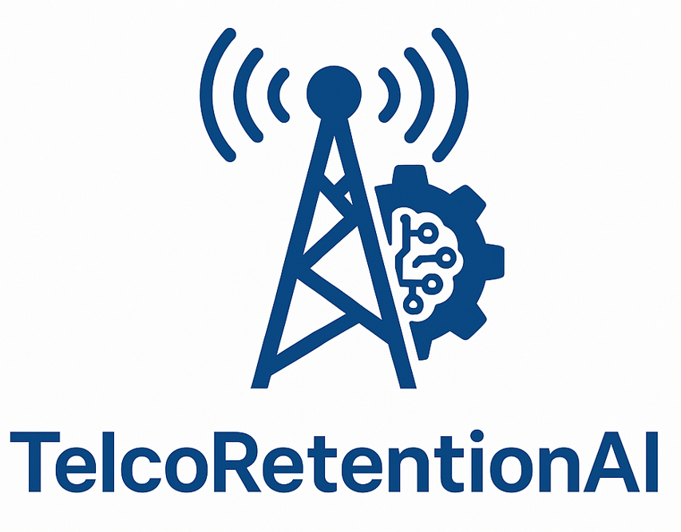

#
# TelcoRetentionAI

📞 **TelcoRetentionAI** is a Machine Learning project designed to predict customer churn in a telecommunications company. It leverages predictive modeling, class balancing and hyperparameter optimization to support targeted customer retention strategies.

- **Project Name**: `telco_retention_ai`
- **Author**: `tralencar`
- **Version**: `0.1.0`
- **License**: `MIT`
- **Keywords**: `telco`, `churn`, `retention`, `customer-lifetime-value`, `AI`
- **Data Source**: [Kaggle - Telco Customer Churn Dataset](https://www.kaggle.com/datasets/blastchar/telco-customer-churn/data)

---

## 🔹 Visual Identity of the TelcoRetentionAI logo

> The *TelcoRetentionAI* logo is not just an aesthetic icon. It is a strategic communication piece that **visually synthesizes the pillars of the project: sector (Telco), purpose (Retention), and differentiation (AI)**.
> As a brand, it conveys **trust, innovation, and business-driven outcomes**, reinforcing the solution’s position as an intelligent and scalable platform for **churn reduction in the telecommunications industry**.

### 1. Clarity and Immediate Association with the Telco Sector
The stylized **"T" in blue** is a direct and recognizable symbol of the **telecommunications** sector. Using this letter as the central shape reinforces the association with telco companies without needing further explanation.

- **Blue color**: Reinforces values such as **trust, stability, technology, and innovation** — key attributes for the telco audience.

### 2. Circular Elements: Metaphor for Retention and Lifecycle
The **circular or looping shapes** surrounding or interacting with the “T” suggest ideas of **customer retention**, **loyalty**, and the **Customer Lifecycle**.

- These elements create a **subconscious visual narrative**: the customer remains within the company’s value cycle.
- They also suggest **continuous movement**, indicating ongoing analysis and proactivity — key pillars of predictive AI systems.

### 3. AI Elements: Modernity and Sophistication
Subtle lines, circuit patterns, or geometric dots symbolize **machine learning, algorithms, and neural networks**.

- Visually communicates that the solution is **tech-based and powered by AI**, adding sophistication and differentiation from traditional BI or CRM tools.

### 4. Integrated Branding Strategy
The visual identity of *TelcoRetentionAI* is designed to **translate the project’s business goals into graphic elements**:

- **Cutting-edge technology** (AI)
- **Customer focus and long-term value** (retention & CLTV)
- **Practical application in telecommunications** (Telco)

This direct connection between **visual brand** and **value proposition** improves **communication with stakeholders, investors, and users**, while enhancing **brand recall**.

---

## 🔹 Features

✅ Programming Language: `Python` 
✅ Hyperparameter optimization with `Optuna` 
✅ Class balancing with `SMOTE` (`imblearn`) 
✅ Evaluation using `scikit-learn` metrics 
✅ Support for `Gradient Boosting`, `Random Forest`, and `Logistic Regression` models 
✅ Code quality ensured by `Pre-commit`, `Ruff`, `Black`, `Flake8`, `Isort`, `Interrogate` 
✅ Task automation with `Makefile` 
✅ Semantic versioning using `bump2version` 
✅ Automated testing with `Pytest` + `Pytest-Cov` 
✅ Notebook linting and quality enforcement using `nbQA` 
✅ Auto-generated documentation with `MkDocs`, `MkDocs Material`, and `mkdocstrings-python` 
✅ Automatic formatting and linting with `Ruff`, `Black`, and `Isort` 
✅ Enhanced documentation design with `mkdocs-bootstrap386` and `pymdown-extensions` 
✅ Git hooks for code validation using `Pre-commit` 
✅ Modular and reusable structure managed with `Poetry` 
✅ **Continuous Integration (CI)** with `GitHub Actions`, including: 
🔹 Code quality checks on every `push` or `pull request` to `main` 
🔹 Automated setup of the `Python` environment with `Poetry` 
🔹 Automatic installation of development dependencies 
🔹 Execution of the `make quality` rule to enforce coding standards

## 🧪 Development Tools

- `ruff` — Linting and formatting (line length = 88, flake8-bugbear, isort, pyflakes, pycodestyle)
- `black` — Code formatter
- `isort` — Import ordering
- `flake8` — Linting
- `interrogate` — Docstring coverage checker
- `pytest`, `pytest-cov` — Unit testing and coverage
- `pre-commit` — Git hooks for automated code checks
- `bump2version` — Semantic version control

## 🔹 Documentation Structure (CRISP-DM aligned)

- **[01 - Business Understanding](01_business_understanding.md)**: Defines the business goals, context and success criteria for churn reduction in a telco company.

- **[02 - Data Understanding](02_data_understanding.md)**: Explores and visualizes the dataset to understand key variables, distributions, and correlations with churn.

- **[03 - Data Preparation](03_data_preparation.md)**: Covers data cleaning, feature engineering, encoding, scaling, and handling class imbalance using SMOTE.

- **[04 - Modeling](04_modeling.md)**: Describes the implementation of classification models (Logistic Regression, Random Forest, Gradient Boosting), including training and hyperparameter settings.

- **[05 - Evaluation](05_evaluation.md)**: Evaluates model performance using metrics such as ROC AUC, precision, recall, and interprets results.

- **[06 - Project Objectives Result](06_project_objectives.md)**: Shows how the objectives of detecting churn drivers, estimating churn risk, and prioritizing customers were met.

- **[07 - Project Goals Result](07_project_goals.md)**: Maps the execution results to strategic and tactical business goals for stakeholder alignment.

- **[08 - Business Recommendations](08_business_recommendations.md)**: Provides actionable insights and next steps to reduce churn based on data-driven results.

- **[09 - Project Conclusion](09_conclusions.md)**: Summarizes the impact, outcomes, and limitations of the TelcoRetentionAI solution.

- **[Installation](installation.md)**: Steps for installing project tools.

- **[Usage Guide](usage.md)**: Instructions on how to run the project.

- **[Project Structure](project_structure.md)**: Describes the organization of files, directories, and logical structure used in the repository.

- **[Contributing Guidelines](contributing.md)**: Guidelines for open-source contributions and collaboration rules.

# CRISP-DM Methodology in TelcoRetentionAI

The **TelcoRetentionAI** project adopted the **CRISP-DM** (Cross-Industry Standard Process for Data Mining) methodology to structure the end-to-end development of a churn prediction solution. Below is a description of each phase as applied to this project.

---

## 📘 1. Business Understanding

The project began with a deep understanding of the telco business problem: **high customer churn**. The strategic goal was to reduce churn rates through **predictive analytics** and **targeted retention actions**.

- **Primary objective**: Predict which customers are likely to cancel their subscription.
- **Secondary objective**: Generate actionable business insights for CRM and marketing campaigns.

---

## 📊 2. Data Understanding

The dataset was explored to understand its structure and identify patterns:

- **EDA techniques** like histograms, KDE plots, and boxplots were applied.
- High churn was observed among:
  - Customers with **month-to-month contracts**.
  - Users without **tech support** or **online services**.
  - **Senior citizens** and **users without a partner**.
- Correlations, distributions, and outlier analyses guided feature engineering and business insights.

---

## 🛠 3. Data Preparation

In this phase, the dataset was cleaned and transformed:

- **Null values removed** and `TotalCharges` cast to numeric.
- **Categorical features** were encoded using `LabelEncoder`.
- The target variable (`Churn`) was mapped to binary.
- **SMOTE** was applied to balance the target classes.
- **Train-test split** ensured a stratified sampling approach.

---

## 🤖 4. Modeling

Three classifiers were trained and compared:

- **Logistic Regression**
- **Random Forest**
- **Gradient Boosting (Best Performer)**

All models were evaluated with:

- `ROC AUC`, `F1-Score`, `Precision`, `Recall`
- Confusion matrices, lift curves, calibration curves, and PR curves.

---

## ✅ 5. Evaluation

The models were assessed both quantitatively and visually:

- **Gradient Boosting** outperformed others in AUC, recall, and calibration.
- **Lift and gain curves** confirmed model stability.
- **SHAP values** were used to interpret predictions.
- **Feature importance** indicated contract type, tenure, and monthly charges as top predictors.

---

## 📈 6. Deployment / Actionable Insights

While not deployed in production, business-oriented deliverables were created:

- **Dashboards and charts** for decision-makers.
- **Scoring system** to prioritize retention based on churn risk × CLTV.
- **Segmented strategies** targeting:
  - Short-tenure customers
  - Users with no add-on services
  - Tech-savvy users using paperless billing

---

## 🎯 Summary

CRISP-DM provided a clear, iterative roadmap to:

- Understand the telco churn problem
- Prepare, model, and evaluate data scientifically
- Deliver **business-driven recommendations**

TelcoRetentionAI stands as a modular, interpretable, and reproducible churn prediction pipeline.
